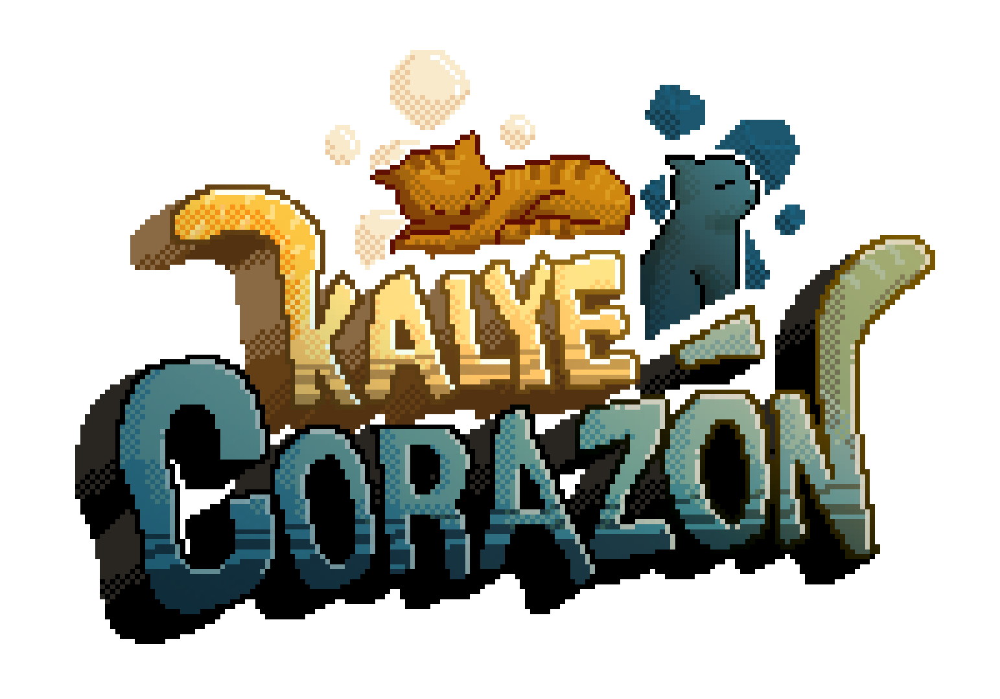

**Kalye Corazon** is a 2D narrative game focused on exploring the culture, heritage, and traditions of Western Visayas.  
You play as **Caleb**, a WVSU tech student whose journey leads him through meaningful spaces around Iloilo, where everyday places reveal stories of identity, history, and local life.

Caleb interacts with local characters, explores heritage-rich environments, and discovers cultural artifacts that connect him to the region’s traditions.

The game blends side-scrolling exploration, branching dialogue, and story-driven minigames to introduce players to Western Visayas culture in an interactive way.

## Table of Contents

1. [Gameplay](#gameplay)
2. [Key Features](#key-features)
3. [Creative Vision](#creative-vision)
4. [Technical Overview](#technical-overview)
5. [Project Structure](#project-structure)

## Gameplay

The core gameplay loop combines side-scrolling exploration, narrative encounters, and interactive cultural puzzle moments.

- **Exploration:**  
  Players travel through locations inspired by Iloilo, from school spaces to heritage streets such as Calle Real.
- **Branching Dialogue:**  
  Conversations with faculty, vendors, and local characters offer choices that shape scene flow and discoveries.
- **Cultural Encounters:**  
  Key moments introduce stories, practices, and perspectives tied to Western Visayas traditions.
- **Artifact Discovery:**  
  Caleb uncovers culturally significant objects (e.g., historical photos, heritage-linked items) that unlock deeper narrative context.
- **Narrative Minigames:**  
  Puzzle interactions (such as reconstructing torn materials) are integrated into cultural storytelling and progression.

## Key Features

- **Culture-Centered Narrative Design**  
  A story experience built around regional identity, local history, and tradition.
- **Western Visayas Heritage Focus**  
  Gameplay highlights places, stories, and cultural references connected to Iloilo and nearby communities.
- **Interactive Learning Through Play**  
  Dialogue and exploration are used to introduce heritage in a natural, engaging format.
- **Choice-Driven Dialogue Progression**  
  Player choices trigger branching events and influence how scenes unfold.
- **Symbolic Companion Guide**  
  Mango helps guide players toward important story and heritage moments.

## Creative Vision

### Art Style

*Kalye Corazon* uses a hand-crafted 2D visual style with atmospheric layering and environment-focused composition.  
The visuals are designed to highlight familiar local spaces while giving them a reflective, storybook-like presentation.

### Narrative Direction

The game’s narrative direction centers on **cultural discovery**.  
Rather than presenting heritage as static information, *Kalye Corazon* lets players experience it through movement, dialogue, and interaction—meeting local voices, entering meaningful places, and uncovering artifacts tied to Western Visayas history and tradition.

## Technical Overview

- **Engine:** Godot Engine 4.x  
- **Language:** GDScript  
- **Dialogue System:** Dialogue Manager addon (`DialogueManager.mutated.emit(...)` for branching and event triggers)

### Core Architecture

- **Dialogue-Led Progression:**  
  Story choices emit mutations (e.g., follow, help, start minigame, proceed) that drive scene logic and level transitions.
- **Modular Narrative Blocks:**  
  Dialogue is structured in reusable scene segments for encounters, puzzles, and cultural reveals.
- **Location-Based Flow:**  
  The game transitions across story spaces (e.g., Queston Hall to Calle Real), with each area introducing distinct cultural content.
- **Puzzle + Story Integration:**  
  Minigames are tied directly to narrative milestones and artifact discovery.

## Project Structure

The project is organized into Godot-style folders, including:

- **`/addons`** – plugin dependencies (including dialogue tooling)
- **`/dialogue`** – dialogue timeline/script files with branching cultural story events
- **`/scenes`** – level, NPC, interaction, and minigame scenes
- **`/scripts`** – gameplay, narrative triggers, and progression logic
- **`/assets`** – art, UI, audio, and cultural visual resources
